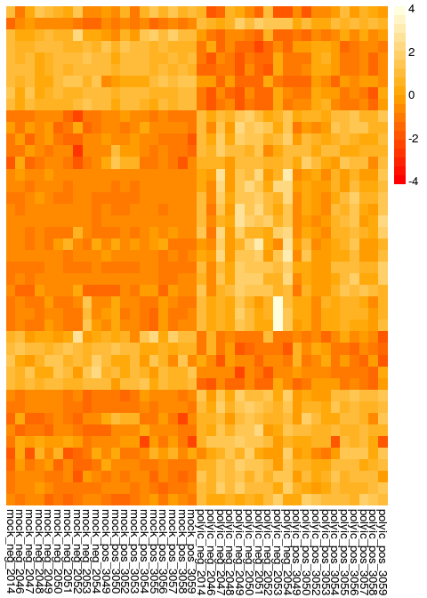
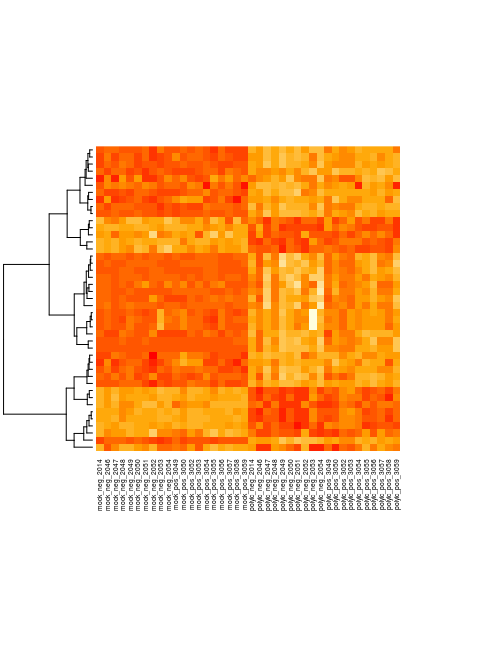

# Example: Differential Expression and Heatmap
Brian High  
2/28/2015  

## Assignment

From: [Biostat-578 HW3](https://github.com/raphg/Biostat-578/blob/master/HW3.md):

Reproduce the results presented in [Figure 2](http://www.ncbi.nlm.nih.gov/pmc/articles/PMC3571267/figure/F2/) of the following paper: 

Qian, F., Bolen, C. R., Jing, C., Wang, X., Zheng, W., Zhao, H., et al. (2013). [Impaired toll-like receptor 3-mediated immune responses from macrophages of patients chronically infected with hepatitis C virus.](http://www.ncbi.nlm.nih.gov/pmc/articles/PMC3571267/) Clinical and Vaccine Immunology : CVI, 20(2), 146–155. doi:10.1128/CVI.00530-12

You will have to:

1. Get the data from GEO
2. Normalize the data (if necessary)
3. Use limma to test for differential expression
4. Display the results using a heatmap [Hint: Use the pheatmap package]

## Using Jia Jin Kee's analysis code

The majority of the code used for this example was adapted, with permission, 
from the Github repository of Jia Jin Kee - 
[jjkee](https://github.com/jjkee/HW2-jjkee).

## Setup

Turn on Knitr cache and set other options. 

The code for this code chunk, with slight modification, was taken from 
[raphg](https://github.com/raphg/Biostat-578).


```r
# Set some global knitr options
library("knitr")
opts_chunk$set(tidy=FALSE, cache=TRUE, messages=FALSE, fig.width=5, fig.height=7)
```

Install the needed packages.


```r
packages <- c("GEOmetadb", "GEOquery", "limma", "lumi", "pheatmap", "gplots")
source("http://bioconductor.org/biocLite.R")
```

```
## Bioconductor version 3.0 (BiocInstaller 1.16.1), ?biocLite for help
```

```r
for (pkg in packages)
{
    require(pkg, character.only = TRUE) || biocLite(pkg) 
}
```

## Normal analysis workflow

We will follow these steps*:

- Import data
- Pre-process
- Fit model(s)
- Make comparisons
- Filter data
- Output results

(* From: James W. MacDonald's presentation, [BioC2010 Using limma for Differential Expression](http://master.bioconductor.org/help/course-materials/2010/BioC2010/limma2.pdf))

We will get the data from NCBI [GEO](http://www.ncbi.nlm.nih.gov/geo/).

## Find GEO accession number

The GEO accession number is provided in the research paper:

> The data files have been deposited in a public database (Gene Expression Omnibus [GEO] accession no. GSE40812, http://www.ncbi.nlm.nih.gov/projects/geo/).

However, we will look it up in GEO, just for practice, using the title of 
the paper as our search term.

To do so, we will need to download the GEO SQLite database, `GEOmetadb`.


```r
library(GEOmetadb)
# This will download the entire database, so can be slow
if(!file.exists("GEOmetadb.sqlite"))
{
  # Download database only if it's not done already
  getSQLiteFile()
}
```

```
## Unzipping...
```

```
## Warning: closing unused connection 5
## (http://gbnci.abcc.ncifcrf.gov/geo/GEOmetadb.sqlite.gz)
```

```
## Metadata associate with downloaded file:
##                 name               value
## 1     schema version                 1.0
## 2 creation timestamp 2015-02-14 19:49:57
```

```
## [1] "/home/high/Documents/HW3-jjkee/GEOmetadb.sqlite"
```

Then we connect to the database and search for the paper by its title.


```r
geo_con <- dbConnect(SQLite(),'GEOmetadb.sqlite')
query <- "SELECT gse.gse 
            FROM gse 
            WHERE gse.title 
            LIKE '%Impaired TLR3-mediated immune responses from macrophages of patients chronically infected with Hepatitis C virus%';"
res <- dbGetQuery(geo_con, query)
```

## Get the ExpressionSet

Now we can load the GEO object into an "eset" object (of class "ExpressionSet").


```r
library(GEOquery)

# Create the data folder if it does not already exist
datadir <- "./Data/GEO/"
dir.create(file.path(datadir), showWarnings = FALSE, recursive = TRUE)

# Construct the data file path from the accession code and folder path
accession <- res$gse
datafile <- paste(c(datadir, accession, "_series_matrix.txt.gz"), collapse = "")

# Download the datafile if it does not already exist and load into eset
if (file.exists(datafile)) {
    # Load the data from the previously downloaded data file using getGEO
    gds <- getGEO(filename = datafile) # getGEO returns an "S4" object
} else {
    # Query GEO for the GEO object matching the accession number
    gds <- getGEO(accession, destdir = datadir)[[1]]  # getGEO returns a "list"
}
```

```
## ftp://ftp.ncbi.nlm.nih.gov/geo/series/GSE40nnn/GSE40812/matrix/
## Found 1 file(s)
## GSE40812_series_matrix.txt.gz
## File stored at: 
## ./Data/GEO//GPL10558.soft
```

## Sanitize the data

We only need data for the macrophage "cell type". This is specificed as 
"Monocyte-derived Macrophage" in the column labeled "source_name_ch1" and 
also in the "characteristic_ch1.1" column as "cell type: Monocyte-derived 
Macrophage". 

Also, since the plot will group by "Mock" ("treatment: Mock") and "Poly(I·C)" 
("treatment: Poly IC H") as well as "VL+" and "VL-", we will also need the 
"characteristic_ch1.2" and "characteristic_ch1" columns, respectively.

Lastly, we need the ID number from the "title" column. Interestingly, the 
"title" is a coded combination of the ID number plus the information described 
above. So, one could also parse this "title" to extract the other needed factors.

The method used to sanitize the data is similar to what was covered in 
[lecture](https://github.com/raphg/Biostat-578/blob/master/Prediction.Rmd).


```r
# Function to sanitize data
sanitize_pdata <- function(pd) {
    # Remove columns we don't need
    keepCols <- c("title", "characteristics_ch1", "characteristics_ch1.1", 
                "characteristics_ch1.2")
    pd <- pd[, keepCols]
    
    # Replace column names with more descriptive ones
    colnames(pd) <- c("ptid", "infection.status", "cell.type", "treatment")
    pd$ptid <- sapply(pd$ptid, FUN=function(x) {
        unlist(strsplit(as.character(x), "_"))[2]})  
    pd$infection.status <- tolower(gsub("infection status: ", "", 
                                      pd$infection.status))  ## neg/pos 
    pd$cell.type <- tolower(gsub("cell type: ", "", 
                               pd$cell.type))  ## monocyte-derived macrophage/pbmc
    pd$treatment <- tolower(gsub("treatment: ", "", 
                               pd$treatment))  ## poly ic h/mock 
    return(pd)
}

# Sanitize the data
pData(gds) <- sanitize_pdata(pData(gds))
```

## Normalize the data

The expression matrix has already been quantile normalized. We are doing this 
step for practice; performing the normalization step again will not change the
data. 

From the paper:

> Raw expression data were normalized using the quantile method provided by the beadarray package in R/Bioconductor (15). 

If we wanted to use the beadarray package, we could try this instead:


```r
library(beadarray)
gds <- neqc(gds)
```

Unfortunately, this will result in an error stating that the data object is of 
the wrong type. The `neqc` function expects an object of class EListRaw or 
a matrix containing raw intensities for regular and control probes from a series 
of microarrays.

So, instead, we will use `limiN` from the lumi package.


```r
library(lumi)
gds <- lumiN(gds, method = "quantile")
```

```
## Perform quantile normalization ...
```

This succeeds because the `lumiN` function expects an ExpressionSet inherited
object or a data matrix with columns as samples and rows as genes.

## Select the macrophage data

We will only be looking at the macrophage "cell type" so we select only 
the macrophage data from eset data object. 


```r
macrophage.data <- gds[, pData(gds)$cell.type=="monocyte-derived macrophage"]
```

## Sort the data

Now we sort the macrophage samples by treatment (poly-IC 
vs mock), infection status (VL- vs VL+) and patient ID. This allows us 
to better reproduce the figure 2 heatmap by arranging the samples (columns) 
as they are presented in that figure.


```r
data.order <- with(pData(macrophage.data), 
                   order(treatment, infection.status, ptid))
pData(macrophage.data) <- pData(macrophage.data)[data.order, ]
exprs(macrophage.data) <- exprs(macrophage.data)[, data.order]
```

## Use limma to test for differential expression

This step is comprised 
of 2 parts. First we find the subset of genes (or probes) that are 
responsive to poly-IC treatment. Secondly, among the subset of genes, we find 
those that are differentially expressed between VL-/VL+ samples.

From the paper:

> Poly(I·C) response signatures were generated based on (i) an absolute fold change of ≥1.5 relative to mock-treated samples and (ii) a statistically significant change in expression as determined by LIMMA (16) using a Benjamani-Hochberg false-discovery rate (FDR) cutoff q value of <0.05.

### Differential expression test: Part I

So let's find subset of probes (or genes) that are responsive to poly-IC 
treatment with FDR cutoff of 0.05 and fold change of >1.5.


```r
library(limma)

# Test for differential expression using limma
design1 <- model.matrix(~treatment, macrophage.data)  
fit1 <- lmFit(macrophage.data, design1)
ebay1 <- eBayes(fit1)

# Find differentially expressed genes (or probes) with FDR cutoff of 0.05 
# and fold change of >1.5
topTable1 <- topTable(ebay1, coef="treatmentpoly ic h", number=Inf, 
                      p.value=0.05, lfc=log2(1.5), sort.by="p")
```

We should see 1146 probes (sum of upregulated and downregulated probe sets: 753 + 393 = 1146), according to the paper:

> After stimulation with TLR3 ligand poly(I·C) for 24 h, we identified 622 genes (corresponding to 753 probe sets) in macrophages that were significantly upregulated and 355 genes (corresponding to 393 probe sets) that were downregulated with an FDR cutoff of 0.05 and a fold change of >1.5 (see Table S1 in the supplemental material).


```r
nrow(topTable1)
```

```
## [1] 1146
```


```r
# Alternatively, you could do it like this ...
topTable1 <- topTable(ebay1, coef="treatmentpoly ic h", number=Inf)
topTable1 <- topTable1[topTable1$adj.P.Val < 0.05 & abs(topTable1$logFC)>log2(1.5), ]
nrow(topTable1)
```

If we used `model.matrix(~treatment+ptid, macrophage.data)`, we would have had 
1153 probes. Should we include `ptid` in our model, since every patient has two 
samples, one treated and the other not treated?

### Subset for the number of probes found

We will need to subset the data, selecting data matching the probe IDs
identified in our previous differential expression test.


```r
# Select the appropriate subset of data for further analysis
topProbes1 <- topTable1$Probe_Id
subset.data <- macrophage.data[rownames(exprs(macrophage.data)) %in% topProbes1, ]
```

For each probe found in previous step, we need to first calculate the fold 
change between each subject's paired mock and poly-IC samples.

From the paper:

> For each probe set corresponding to a gene, a fold change was computed by comparing differential expression in VL− and VL+ samples, as described above.

### Construct multiplication matrix

Now construct a new matrix to multiply by the expression matrix, such that 
values that correspond to "mock" samples have a value of 1 and "poly ic h" 
samples have a value of -1.


```r
treatment.matrix <- matrix(0, nrow=nrow(exprs(subset.data)), 
                           ncol=ncol(exprs(subset.data)))
treatment.matrix[, which(pData(subset.data)$treatment=="mock")] <- 1
treatment.matrix[, which(pData(subset.data)$treatment=="poly ic h")] <- -1

# construct matrix to identify samples belonging to each patient
patient.matrix <- model.matrix(~ptid, subset.data)

# modify patient matrix so that the first column corresponds to the first patient
first.ptid <- pData(subset.data)$ptid[1]
colnames(patient.matrix)[1] <- paste0("ptid", first.ptid)
patient.matrix[which(pData(subset.data)$ptid != first.ptid), 1] <- 0 

# calculate fold change between each subject's paired mock and poly-IC sample
exprs(subset.data) <- (exprs(subset.data) * treatment.matrix) %*% patient.matrix

# limit data to one row per patient (just choose the one corresponding to poly-IC)
pData(subset.data) <- pData(subset.data)[pData(subset.data)$treatment=="poly ic h", ]  
```

### Differential expression test: Part II

Next, calculate the fold change for VL- patients compared with VL+ patients, 
also using `limma`.


```r
# Test for differential expression using limma
design2 <- model.matrix(~infection.status, subset.data)
fit2 <- lmFit(subset.data, design2)
ebay2 <- eBayes(fit2)

# Find differentially expressed genes (or probes) with unadjusted p-value < 0.1
topTable2 <- topTable(ebay2, coef="infection.statuspos", adjust.method="none", 
                      number=Inf, p.value=0.1)  
topProbes2 <- topTable2$Probe_Id
```

## Compare expression results with the paper

Let's check if the number of probes and genes reported in the paper are the 
same as what we have found. The paper reported finding 43 differentially 
expressed probes (30 upregulated in VL- samples, 13 upregulated in VL+ samples).


```r
length(topProbes2)  ## number of probes
```

```
## [1] 43
```

```r
sum(topTable2$logFC > 0)  ## number of upregulated probes in VL+ samples
```

```
## [1] 30
```

```r
sum(topTable2$logFC < 0)  ## number of upregulated probes in VL- samples
```

```
## [1] 13
```

From the paper:

> However, to focus on genes that may contribute to successful clearance of HCV, we identified 43 probe sets that had a P value of <0.1 (30 had higher expression in VL− samples; 13 had higher expression in VL+ samples; see Table S1 in the supplemental material) for further analysis.

## Display the results using a heatmap

The assignment gave us a hint to use the pheatmap package. First, we'll do some
data preparation.


```r
# Select only those probes matched in the previous differential expression step
exprs.data <- exprs(macrophage.data)[
    rownames(exprs(macrophage.data)) %in% topProbes2, ]

# Use descriptive column names instead of creating the labeled dendrogram
colnames(exprs.data) <- paste(pData(macrophage.data)$treatment, 
                              pData(macrophage.data)$infection.status, 
                              pData(macrophage.data)$ptid, sep="_")
```

Next, plot using `pheatmap` defaults, except only cluster rows, not columns.


```r
library(pheatmap)
pheatmap(exprs.data, cluster_cols=FALSE) 
```

 

While the default settings produce a nice-looking heatmap, we will need to make
some adjustments to approach the look of the published heatmap.

### Customizing with `pheatmap`

Primarily, we will use a different color pallete and clustering method.


```r
drows <- dist(exprs.data, method = "euclidean")
hmcols<-colorRampPalette(c("red", "orange", "lightyellow"))(20)
pheatmap(exprs.data, cluster_cols=FALSE, cluster_rows=TRUE, 
         clustering_method="ward", clustering_distance_rows = drows, 
         scale="row", show_rownames=FALSE, border_color=NA, treeheight_row=0, 
         color = hmcols
         ) 
```

```
## The "ward" method has been renamed to "ward.D"; note new "ward.D2"
```

 

Using `pheatmap`, we got fairly close to the published figure, but the clustering 
is still not exactly the same. It looks like it's flipped (vertically, 180 
degrees), compared to the published figure, plus some some smaller differences. 

Also, we don't have the labeled dendrogram at the top. That's why we use the 
more descriptive column labels instead. The key is quite different looking, 
too, but the range (-4 to 4) is the same. The colors are pretty similar, though.

### Using `heatmap`

We can also use `heatmap` from the stats package, though even with 
`keep.dendro=FALSE`, the dendrogram persists. The clustering is a better 
match to the published figure.


```r
library(stats)
hmcols<-colorRampPalette(c("red", "orange", "lightyellow"))(20)
heatmap(exprs.data, Colv=NA, labRow=NA, keep.dendro=FALSE, 
        hclustfun=function(d) hclust(d, method="ward.D2"),
        distfun=function(x) dist(x, method="euclidean"),  
        cexRow=0.5, cexCol=0.5, col=hmcols)
```

 

### Using `heatmap.2`

Instead, if we use the `heatmap.2` function from the gplots package, we 
can do a much better job of matching the heatmap in the paper. 


```r
library(gplots)
hclust.ward <- function(x) hclust(x, method="ward.D2")
dist.eucl <- function(x) dist(x, method="euclidean")
heatmap.2(exprs.data, scale="row", dendrogram = "none",  
          symkey=FALSE, density.info="none", trace="none", 
          cexRow=0.7, cexCol=1, margins=c(10,0), labRow=FALSE, 
          lmat=rbind( c(0, 3, 4), c(2,1,1) ), lwid=c(1, 3, 2), 
          hclustfun=hclust.ward, distfun=dist.eucl, Colv=NA, 
          key=TRUE, keysize=1.0
          )
```

 

So, how could we add the custom dendrogram at the top of the figure as published?
